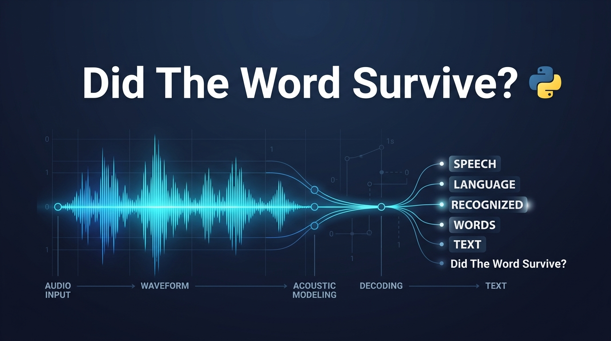
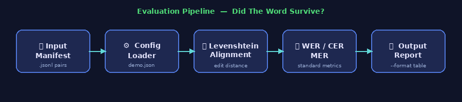
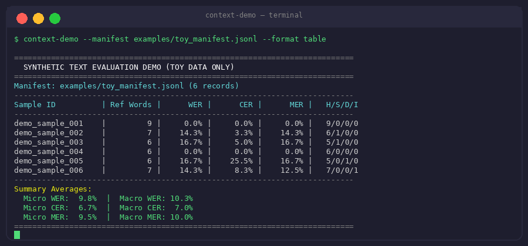

<p align="center">
  
</p>

<p align="center">
  <a href="https://www.python.org/"></a>
  <a href="LICENSE"></a>
  
  
  
</p>

<h1 align="center">Did The Word Survive?</h1>

<p align="center">
  A minimal, dependency-free Python toolkit for computing standard speech-recognition<br>
  evaluation metrics — WER, CER, and MER — from text pairs.
</p>

---

## Overview

This repository demonstrates lightweight text-based error rate computation using standard edit-distance (Levenshtein) alignments. It includes:

- **Word Error Rate (WER)** — fraction of word-level substitutions, deletions, and insertions
- **Character Error Rate (CER)** — same computation at the character level
- **Match Error Rate (MER)** — matches over total aligned tokens

It does **not** provide model checkpoints, audio processing pipelines, or experimental reproduction data.

---

## Evaluation Pipeline

<p align="center">
  
</p>

The pipeline reads a `.jsonl` manifest of reference/hypothesis text pairs, applies configurable normalization (lowercase, punctuation removal), runs Levenshtein alignment, and outputs per-sample and summary statistics.

---

## Demo Output

<p align="center">
  
</p>

---

## Installation

The demo runs on standard Python 3.9+ with **zero external dependencies**:

```bash
git clone https://github.com/LatentContext/did-the-word-survive.git
cd did-the-word-survive
pip install -e .
```

Or run directly without installation:

```bash
python3 src/context_demo/cli.py --manifest examples/toy_manifest.jsonl --config configs/demo.json
```

---

## Usage

**Table format** (human-readable):
```bash
context-demo --manifest examples/toy_manifest.jsonl --config configs/demo.json --format table
```

**JSON format** (machine-readable):
```bash
context-demo --manifest examples/toy_manifest.jsonl --config configs/demo.json --format json
```

**Plain text summary**:
```bash
context-demo --manifest examples/toy_manifest.jsonl --config configs/demo.json --format text
```

---

## Repository Structure

```
did-the-word-survive/
├── assets/                   # Visual assets (banner, pipeline diagram, demo screenshot)
├── configs/
│   └── demo.json             # Generic text normalization and evaluation options
├── examples/
│   └── toy_manifest.jsonl    # Synthetic invented text pairs (not real transcripts)
├── schemas/
│   └── demo_manifest.schema.json  # JSON schema for manifest records
├── src/context_demo/
│   ├── __init__.py
│   ├── cli.py                # Runnable CLI driver
│   └── metrics.py            # Standard WER / CER / MER implementations
└── tests/
    └── test_demo.py          # Unit tests (17 checks)
```

---

## Metrics Definitions

| Metric | Formula | Denominator |
|--------|---------|-------------|
| **WER** | (S + D + I) / N | Number of words in reference |
| **CER** | (S + D + I) / N | Number of characters in reference |
| **MER** | (S + D + I) / (H + S + D + I) | Total aligned tokens |

Where **H** = hits, **S** = substitutions, **D** = deletions, **I** = insertions.

> **Note:** All scores are reported as percentages. An empty reference raises an explicit error rather than returning zero or infinity.

---

## Note on Synthetic Data

All reference and hypothesis pairs in `examples/` are **synthetic, newly invented** sample sentences, created solely to verify metric computation. They do not represent real speech corpus transcripts, model outputs, or experimental measurements.

---

## License

This project is licensed under the [MIT License](LICENSE).
